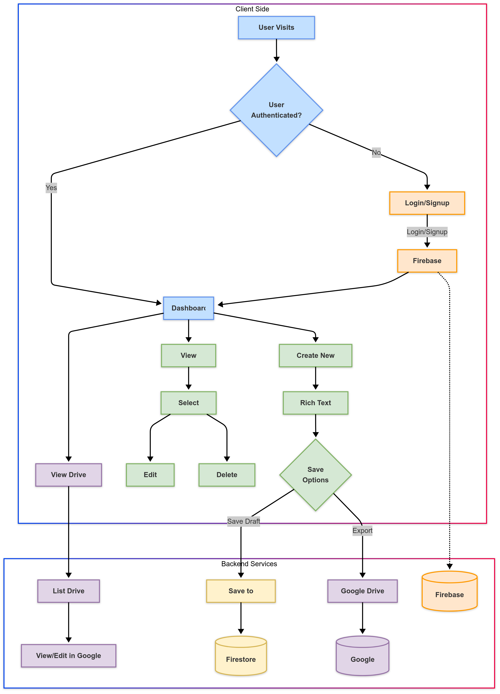

Letter App
<div align="center"><strong>Modern Letter Creation Tool with Google Drive Integration</strong></div> <div align="center">Built with Next.js 14 App Router</div> <br /> <div align="center"> <a href="https://letter-app-assignment.vercel.app/">View Demo</a> <span>

</div>

# Overview

The Letter App is a comprehensive solution for creating, managing, and sharing professional-looking letters. Built with Next.js 14, it features a powerful rich text editor and seamless Google Drive integration, allowing users to:

- Create beautifully formatted letters
- Save drafts locally and to Google Drive
- Convert letters to Google Docs format
- Manage all letter content in one dashboard
- Collaborate and share through Google's platform

This system provides an intuitive interface for letter writing, formatting, and management, enhancing productivity for professionals who regularly draft correspondence.

# Tech Stack

- Framework - Next.js 14
- Language - TypeScript
- Database - Firebase Firestore
- Authentication - Firebase Auth
- UI Components - shadcn/ui
- Styling - Tailwind CSS
- Rich Text Editing - TipTap
- Cloud Storage - Google Drive API
- State Management - React Context API


### Key Features:

- Rich Text Editor with TipTap
- Google Drive Integration
- Automatic Draft Saving
- Responsive Design for All Devices
- Firebase Authentication
- Centralized Letter Management Dashboard

********************************************************************************
# System Requirements

- Node.js 16.8 or later
- npm v7 or later (or yarn/pnpm)
- Windows, macOS, or Linux
- Modern web browser (Chrome, Firefox, Safari, Edge)

********************************************************************************
# Installation Instructions
1. Setup Project
  ## Clone repository
  ```bash
  -git clone https://github.com/preityzz/letter-app-assignment
  ```

  ## Change Directory:
  
  ```bash
  cd letter-app
  ```
   

  ## Install dependencies
   
  npm install
# or
  yarn install
# or
  pnpm install
 

2. Environment Configuration
  ## Create .env.local file
  .env.local

  ### Update .env with your values
- NEXT_PUBLIC_FIREBASE_API_KEY=your-api-key
- NEXT_PUBLIC_FIREBASE_AUTH_DOMAIN=your-auth-domain
- NEXT_PUBLIC_FIREBASE_PROJECT_ID=your-project-id
- NEXT_PUBLIC_FIREBASE_STORAGE_BUCKET=your-storage-bucket
- NEXT_PUBLIC_FIREBASE_MESSAGING_SENDER_ID=your-messaging-sender-id
- NEXT_PUBLIC_FIREBASE_APP_ID=your-app-id
- NEXT_PUBLIC_GOOGLE_CLIENT_ID=your-google-client-id

3. Firebase Setup

### Create a Firebase project

- Go to Firebase Console
- Add a new project
- Enable Authentication (Email/Password and Google providers)
- Create a Firestore database
- Add your app to the Firebase project to get configuration values

4. Google Drive API Setup

### Enable Google Drive API

- Go to Google Cloud Console
- Create a new project or select existing one
- Enable Google Drive API
- Create OAuth consent screen
- Generate credentials (OAuth client ID)
- Add authorized JavaScript origins and redirect URIs

********************************************************************************
# Running Instructions

## Development Server
 ```bash
npm run dev
# or
yarn dev
# or
pnpm dev
  ```

**********************************************************************************

# Project Structure
- letter-app/
- ├── app/                   # Next.js app router pages
- ├── components/            # React components
- │   ├── editor/            # Editor-related components
- │   ├── drive/             # Google Drive integration UI
- │   └── ui/                # UI components from shadcn/ui
- ├── firebase/              # Firebase configuration
- ├── types/                 # TypeScript type definitions
- ├── utils/                 # Utility functions
- │   ├── googleAuth.ts      # Google authentication utilities
- │   └── googleDrive.ts     # Google Drive API utilities
- └── public/                # Static assets

************************************************************************************
## Design Overview 

